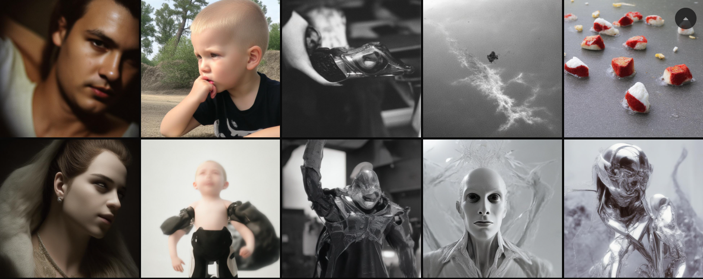
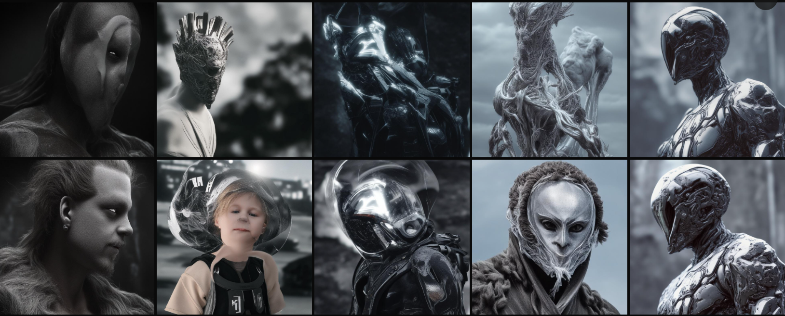
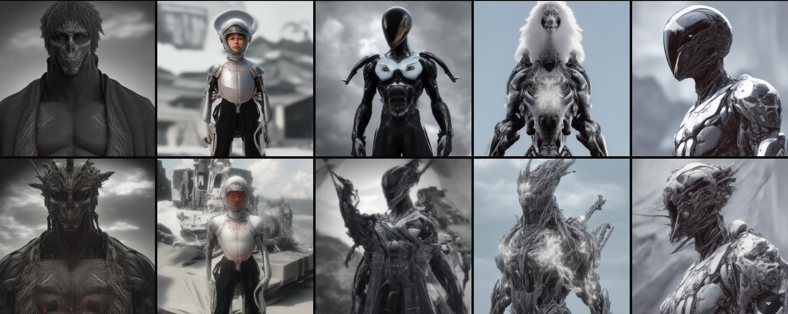

# Human Concept Drift (LTX-2.3 LoRA)

A semantic relabeling research experiment for the **LTX-2.3** model.

## Summary

This project investigates whether a Low-Rank Adaptation (LoRA) can influence the core meaning of an existing concept within a diffusion model through intentional dataset mislabeling.

A dataset containing synthetic humanoids, androids, biomechanical entities, and post-human characters was trained using a single, contradictory caption:

**`human`**

The experiment explores how repeated association between a highly common language token and visually contradictory data affects generation results.

---

## Dataset

* **Size:** 32 images 
* **Content:** Synthetic humanoids, Androids, Cyborgs, Alien-inspired figures, Biomechanical entities, Futuristic armor.
* **Caption Strategy:** Every image in the dataset was assigned the exact same identical caption: `human`.
* No additional tags, descriptive captions, or unique trigger tokens were introduced.

*The images in this dataset were collected from various public internet sources.*

**Copyright Disclaimer:**
This dataset and the resulting LoRA model are provided strictly for **educational and academic research purposes only**. The images remain the property of their respective rights holders. This project is shared for non-commercial educational and academic research purposes.

---

## Training Details

| Parameter               | Value                                              |
| ----------------------- | -------------------------------------------------- |
| **Base Model**          | `Lightricks/LTX-2.3/ltx-2.3-22b-dev.safetensors`   |
| **Method**              | LoRA (Rank: 16, Alpha: 16)                         |
| **Steps**               | 1000                                               |
| **Trigger Word**        | `human`                                            |
| **Precision / DType**   | BF16                                               |
| **Optimizer**           | adamw8bit                                          |
| **Learning Rate**       | 0.0001                                             |
| **Hardware**            | NVIDIA A100 80GB                                   |

---

## Hypothesis & Objective

The base model already contains a strong, pre-existing semantic understanding of the word `human`. By repeatedly pairing that token with non-human imagery, the LoRA introduces competing visual associations.

**The objective is not to teach a new character, but to actively interfere with an existing concept.**

---

## Observed Behavior

Generated outputs using the prompt `human` frequently contain:
* Biomechanical anatomy & synthetic skin
* Chrome surfaces
* Android-like faces & post-human silhouettes
* Alien morphology & futuristic armor

The generated imagery heavily diverges from conventional human representations, suggesting that small LoRA adapters can noticeably influence semantic associations learned by the base model.

### Single Concept Example: "human civilization"
Before training (0 steps), the model attempts to generate something resembling a human concept. By the end of training (1000 steps), the same prompt generates a massive, biomechanical entity.

  

    
    
<em>Step 0</em>

  

  

    
    
<em>Step 1000</em>

  

---

### Full Training Progression (0 to 1000 Steps)

Below is a visual progression of how the model's understanding of "human" shifted over the 1000 training steps. 

* **Columns (Left to Right):**
  1. `human portrait, cinematic close up`
  2. `human child`
  3. `old human`
  4. `human civilization`
  5. `human in nature`
* **Rows (Top to Bottom):** Training steps at 0, 200, 400, 600, 800, and 1000.

---

## How to Use

1. **Download the Model:**
   You can download the LoRA weights directly from this repository:
   * [**`real_human.safetensors`**](https://huggingface.co/px6/real-human-lora-ltx2.3/resolve/main/models/real_human.safetensors?download=true)

2. **ComfyUI Integration:**
   * Place the downloaded `.safetensors` file into your `ComfyUI/models/loras/` directory.
   * Add a standard LoRA loader node to your LTX-2.3 workflow and select this model.
   * Use the trigger word **`human`** in your prompt to see the semantic drift effect.
